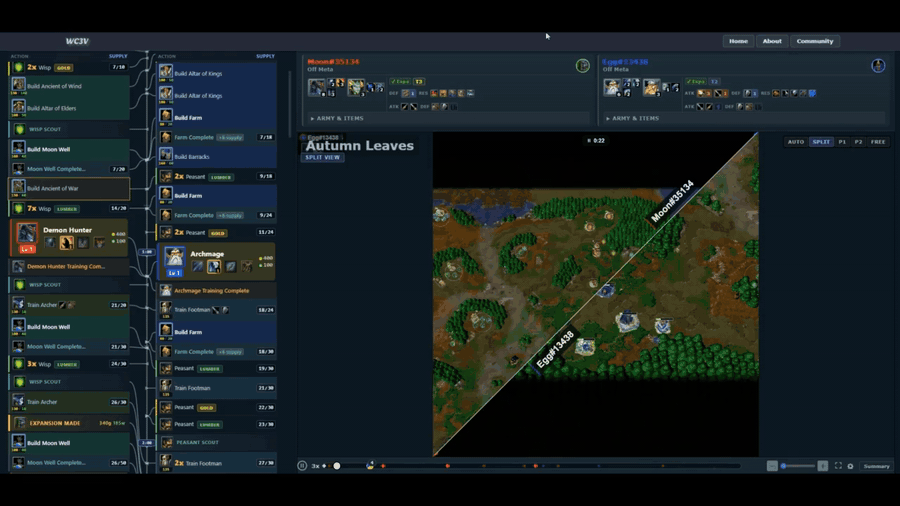
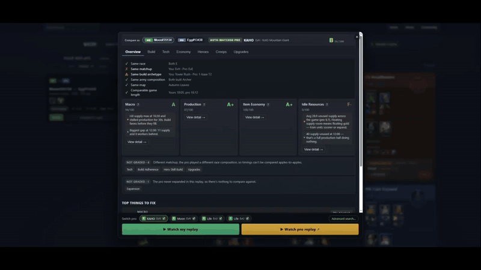
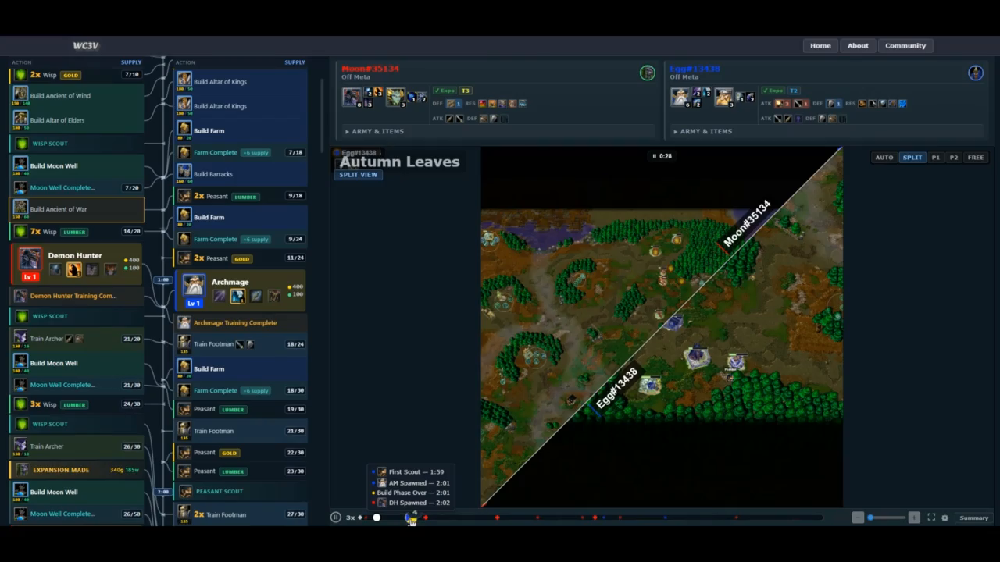
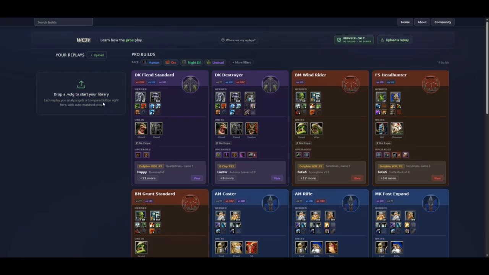
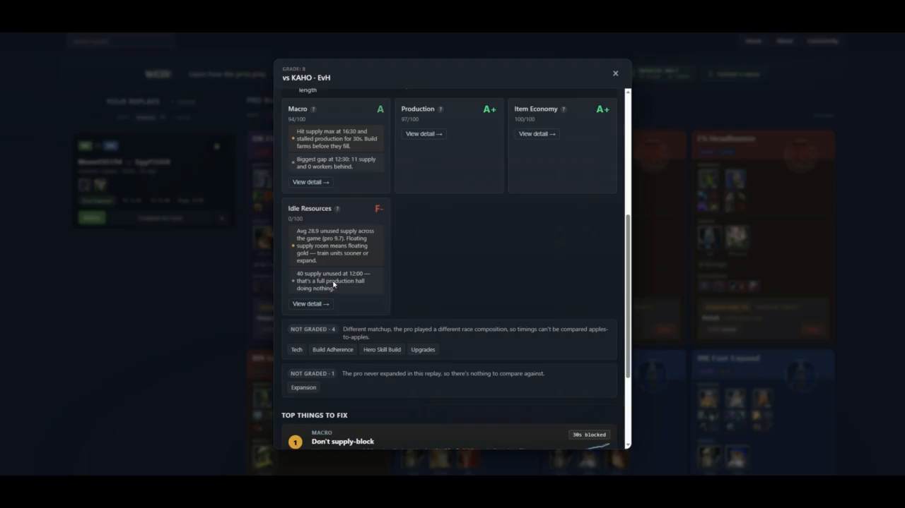

# WC3V

**W**ar**c**raft **3** Replay **V**iewer — a visual replay analyzer, pro build library, and compare-to-pro coach for Warcraft III.

🌐 **Live: [wc3v.com](https://wc3v.com)** — drop a `.w3g`, parsed locally in your browser, never uploaded.



## What it does

Three things, all from a `.w3g` replay file:

1. **Visual replay** — reconstructs unit movement, building construction, hero levels, research, and combat from raw player inputs and renders them on a 3D heightmap with synced supply-indexed build order timeline.
2. **Pro build library** — 16 curated competitive builds across all races and matchups, each backed by real pro replays from 12+ tournaments. Filterable by race, matchup, opener, and tournament.
3. **Compare to a pro** — drop your replay, get auto-matched against the closest pro game by race/matchup/opener, then see letter-graded feedback on macro, production, item economy, idle resources, build order, tech, and hero skill choices — with itemized findings and supply curves overlaid.



## Privacy

WC3V parses your replays **entirely in your browser** — the `.w3g` never leaves your device. Parsed data lives in IndexedDB, scoped to your origin. No accounts, no uploads, no server. The Node.js parser in this repo is the same code, browserified into [client/js/vendor/wc3v-parser.bundle.js](client/js/vendor/wc3v-parser.bundle.js) via [tools/build-parser-bundle.js](tools/build-parser-bundle.js).

## Features

### Replay analysis
- **Game simulation** — reconstructs the full match from raw player inputs
- **Worker tracking** — race-specific mechanics: peon consumption, wisp sacrifice, ghoul lumber, peasant builders
- **Hero tracking** — levels, skill builds, inventory, revives, item buys
- **Research & upgrades** — 90 upgrades tracked with icons, costs, and per-level timing (attack/defense/ability)
- **Expansion detection** — identifies town hall placements at new gold mines
- **Transport tracking** — Zeppelin load/unload events
- **Parse confidence** — quantified reliability score (0–1) per player
- **Replay validation** — flags tier contradictions, missing supply buildings, data inconsistencies
- **W3C / FLO support** — handles W3Champions and FLO replays alongside standard Battle.net replays

### Visual replay
- **3D terrain** — Three.js heightmap rendering for 80+ maps, tileset-aware ground colors, fog of war
- **Split-view camera** — diagonal split for two-player matches; broadcast-style auto-camera modes
- **Build order panel** — supply-indexed timeline with tier transitions, research/upgrade cards, expansion banners, composition snapshots
- **Minimap pips, building tooltips, floating text, hero trails** — broadcast-quality overlays
- **Scrubbable playback** — jump to any moment, rewind, variable speed



### Pro build library
- **16 curated builds** across Human (4), Orc (3), Night Elf (4), Undead (5)
- **Matchup filter** — `HvO`, `UvN`, etc.
- **Tier progression** — t1/t2/t3 buildings, units, timing windows, conditional branches
- **Replay-backed** — every build links to one or more pro games you can play through visually
- **221 pro replay references** across **12 tournaments** (WGL Summer/Pro, Being Esports, Back2Warcraft, NetEase WGL/WPL, Blizzard Classic, etc.)



### Compare-to-pro
- **Auto-matcher** finds the closest pro replay by race, matchup, opener, archetype, map, and game length
- **Compatibility checks** — same race, matchup, build archetype, army comp, map, comparable game length
- **Letter grades** per category: Macro · Production · Item Economy · Idle Resources
- **Itemized findings** — "Hit supply max at 16:30 and stalled production for 30s, build farms before they fill"
- **Top things to fix** — prioritized actionable list
- **Charts** — supply curves, worker counts, side-by-side over time
- **Tab drill-downs** — Build order events, Tech timing, Economy, Heroes (skill build), Creeps (route + XP), Upgrades



## Quick start

### Use it

Just go to **[wc3v.com](https://wc3v.com)** and drop a `.w3g` file. Parsing happens in your browser; nothing is uploaded.

### Run it locally

**Prerequisites:** [Node.js](https://nodejs.org/) 18+

```bash
# 1. Drop .w3g files in ./replays/  (pattern: ./replays/<name>.w3g)
# 2. Parse one — `happy-vs-grubby` is the canonical example used throughout
#    these docs; substitute any file name you dropped in ./replays/
node wc3v.js --replay=happy-vs-grubby
# Outputs ./client/replays/happy-vs-grubby.wc3v.gz

# 3. Serve the client
cd client && npx http-server
# open the printed URL
```

If you don't have a `.w3g` handy, the parsed output of `happy-vs-grubby` is checked into `docs/` — see [Output format](#output-format-wc3v) below for a guided walkthrough.

Note that the viewer needs WC3 game data (icons, unit balance, map files) to be set up before it can render anything — see [Data Setup](#data-setup) below. Without those, the parser still works but the viewer renders blank.

### Debug mode

Keep the uncompressed `.wc3v` JSON alongside the `.gz` for inspection:

```bash
node wc3v.js --replay=happy-vs-grubby --debug
```

### Inspect parsed data from the CLI

```bash
node inspect-replay.js --replay=happy-vs-grubby --show=summary
node inspect-replay.js --replay=happy-vs-grubby --show=events --player=1 --filter=research
node inspect-replay.js --replay=happy-vs-grubby --show=units --search=Blademaster
```

Sections: `players`, `events`, `workers`, `units`, `tiers`, `expansions`, `summary`, `all`. Don't `cat`/`grep` the `.wc3v` files directly — they're 1M+ lines of JSON. The inspect tool is the proper interface.

## Architecture

```
.w3g replay file
      │
      ├── tools/build-parser-bundle.js
      │     │
      │     ▼
      │   client/js/vendor/wc3v-parser.bundle.js  (browser)
      │
      ▼
  wc3v.js (Node.js parser)
  ┌─────────────────────────────────────┐
  │  w3gjs decodes raw replay actions   │
  │  Game engine simulates:             │
  │    unit registration & backfilling  │
  │    building construction queue      │
  │    worker mechanics per race        │
  │    research/upgrade tracking        │
  │    expansion detection              │
  │    tier progression                 │
  │  Post-processing:                   │
  │    parse confidence scoring         │
  │    ReplayValidator checks           │
  │    spawn camp filtering             │
  └─────────────────────────────────────┘
      │
      ▼
  .wc3v.gz (compressed JSON)  ──────►  IndexedDB (browser, never uploaded)
      │
      ▼
  Client (browser)
  ┌──────────────────────────────────────────────────────────┐
  │  Wc3vViewer (coordinator, app.js)                        │
  │   ├─ ThreeMapRenderer    — 3D terrain (Three.js)         │
  │   ├─ MapRenderer         — 2D canvas overlay             │
  │   ├─ BuildOrderRenderer  — supply-indexed BO panel       │
  │   ├─ BroadcastCamera     — auto-camera modes             │
  │   ├─ TimeScrubber        — playback control              │
  │   ├─ FogOfWar            — non-playable area mask        │
  │   └─ FloatingText / Pips / Tooltips / Splats             │
  │                                                          │
  │  ReplayAnalyzer  + CompareMatcher  + CompareInline       │
  │   ├─ Auto-matches user replay vs pro library             │
  │   ├─ Letter grades + findings + charts                   │
  │   └─ AdvancedComparePicker for manual override           │
  └──────────────────────────────────────────────────────────┘
```

See [docs/DESIGN.md](docs/DESIGN.md) for a deeper dive into replay parsing, unit registration, backfilling, and simulation mechanics.

## Output format (.wc3v)

The parser produces `.wc3v` files — JSON documents containing the full simulated game state:

| Section | Description |
|---|---|
| `players` | Per-player: event stream, unit list, tier stream, research stream, worker counts, APM, base grid |
| `world` | Neutral creep camps with claim state, XP distribution, item drops, combat timelines |
| `replay` | Replay metadata: map name, player names, game settings, slot records |
| `validation` | Optional data quality warnings (tier mismatches, missing data) — present only if issues found |

**Full schema:** [docs/wc3v-schema.json](docs/wc3v-schema.json) (JSON Schema draft 2020-12)

**Example output:** [docs/happy-vs-grubby.wc3v.gz](docs/happy-vs-grubby.wc3v.gz) (gzip-compressed JSON, ~1.1 MB) — Happy (UD) vs FollowGrubby (Orc) on Concealed Hill, the same replay used as `--replay=happy-vs-grubby` throughout this README. See [docs/wc3v-example.md](docs/wc3v-example.md) for a guided walkthrough of the file's structure with real values, plus a trimmed [`docs/wc3v-example.json`](docs/wc3v-example.json) you can read in an editor.

## Data setup

WC3V needs data extracted from a legally owned copy of Warcraft III to render anything visually. These files are not distributed in this repository — provide them yourself from your own game install. The repo is structured so every required path is gitignored; drop your files in and the parser/viewer will pick them up.

### What you need

| Destination | What goes there | Source |
|---|---|---|
| `helpers/UnitBalance.json` | Unit balance data (costs, stats, collision sizes) | Generated from `slk/UnitBalance.slk` — see below |
| `slk/UnitBalance.slk` | Raw unit balance spreadsheet | Extract from WC3 CASC (`war3.w3mod/units/unitbalance.slk`) |
| `tools/upgrade-data/upgradedata.slk` | Raw upgrade data | Extract from WC3 CASC (`war3.w3mod/units/upgradedata.slk`) |
| `tools/upgrade-data/{race}upgradefunc.txt` | Per-race upgrade scripts | Extract from WC3 CASC — one per race: `human`, `orc`, `nightelf`, `undead`, `neutral`, `campaign` |
| `tools/upgrade-data/*.dds` | Upgrade icons | Extract + convert from WC3 CASC |
| `client/assets/wc3icons/*.jpg` | Unit/building/ability icons (~1800 files) | Extract via [war3observer](https://github.com/warlockbrawl/war3observer), convert BLP → JPG |
| `mapdata/{MapName}/` | Raw map file extracts per map | Generated by `tools/data-tool.js` from `.w3x` map files — see below |
| `client/maps/{MapName}/` | Browser-ready map cache (terrain images, doodads, neutral buildings) | Auto-generated from `mapdata/` when the parser first encounters a map |

**Recommended tool for CASC extraction:** [Ladik's CASC Viewer](http://www.zezula.net/en/casc/main.html) — point it at your WC3 install's `Data` folder.

### Setup steps

**1. Unit balance data**
```bash
# Extract unitbalance.slk into slk/UnitBalance.slk first, then:
cd slk && node slk.js && cd ..
cp slk/UnitBalance.json helpers/UnitBalance.json
node tools/add-attack-types.js   # enriches with attackType fields
```

**2. Research / upgrade metadata** (`helpers/researchMeta.json` is tracked — only regenerate if needed)
```bash
node tools/parse-upgrade-data.js
```

**3. Maps**
```bash
node tools/data-tool.js --source=/path/to/w3x/folder --version=v11
# Flags: --source, --version, --list, --prefix
```

**4. Icons** — follow [war3observer](https://github.com/warlockbrawl/war3observer) and place `.jpg` files in `client/assets/wc3icons/`.

### Optional: 3D rendering pipeline

The 3D terrain renderer can fall back to flat shading if these aren't set up.

| Tool | Purpose |
|---|---|
| `tools/convert-terrain-dds.js` | Convert WC3 terrain DDS textures for Three.js |
| `tools/convert-mdx-to-gltf.js` | Convert WC3 building MDX models → glTF for the 3D scene |
| `tools/convert-building-textures.js` | Building texture prep |
| `tools/convert-splat-textures.js` | Splat / decal textures |
| `tools/convert-doodad-textures.js` | Tree / doodad textures |

3D assets land in `client/assets/{terrain,models,textures,buildings,trees,cliffs}/` (all gitignored).

## Tools

| Tool | Description |
|---|---|
| `inspect-replay.js` | Query parsed replay data from the CLI (events, units, workers, tiers, expansions, summary) |
| `tools/data-tool.js` | Extract map terrain, trees, neutral buildings from `.w3x` map files |
| `tools/regen-maps.js` | Regenerate map images from already-extracted mapdata (no `.w3x` needed) |
| `tools/regen-neutral-buildings.js` | Rebuild neutral building data per map |
| `tools/regen-unit-cache.js` | Rebuild client-side unit metadata cache |
| `tools/add-replay.js` | Replay onboarding pipeline: scan, parse, summary, manifest-check |
| `tools/reparse-builds.js` | Batch re-parse every manifest replay (after parser changes) |
| `tools/match-replays.js` | Match user replays against the manifest by archetype |
| `tools/refine-builds.js` | Cleanup/validation of build classifications |
| `tools/parse-upgrade-data.js` | Generate `researchMeta.json` from WC3 game data |
| `tools/parse-ability-orders.js` | Extract hero skill upgrade sequences |
| `tools/build-parser-bundle.js` | Browserify the parser into `client/js/vendor/wc3v-parser.bundle.js` |
| `tools/sync-manifest-fingerprints.js` | Maintain manifest consistency |
| `tools/add-attack-types.js` | Enrich `helpers/UnitBalance.json` with attackType fields |
| `tools/import-replays.js` | Batch import from external sources |

For the full pro-replay onboarding workflow (acquiring packs, matching to builds, adding tournaments), see [docs/REPLAY_ONBOARDING.md](docs/REPLAY_ONBOARDING.md).

## Testing

```bash
node wc3v.js --test       # parse the regression suite + manifest replays
node wc3v.js --promaps    # parse only manifest replays
```

These verify the parser produces valid output without fatal errors across the full library.

## Credits

- [w3gjs](https://github.com/PBug90/w3gjs) — W3G replay file decoder
- [w3g_format.txt](https://github.com/scopatz/w3g/blob/master/w3g_format.txt) — replay format documentation
- [war3observer](https://github.com/warlockbrawl/war3observer) — icon extraction
- [Three.js](https://threejs.org) — 3D terrain rendering
- [D3.js](https://d3js.org) v5 — timeline math and chart rendering
- [RBush](https://github.com/mourner/rbush) — spatial indexing for unit grouping

## License

[GNU General Public License v3.0](LICENSE.md)

---

All code, assets, names, and concepts are used for educational purposes only and have no commercial or retail usage. All copyright and trademark are respective to their original owners. All software learned from public sources and from rightfully owned copies of the game.
