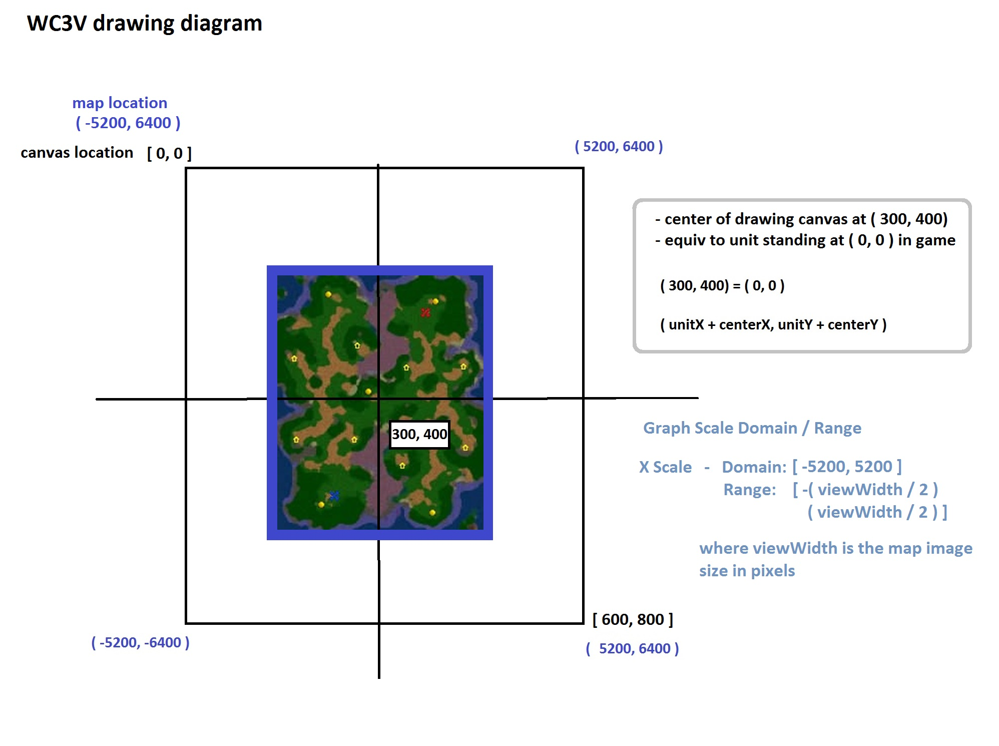
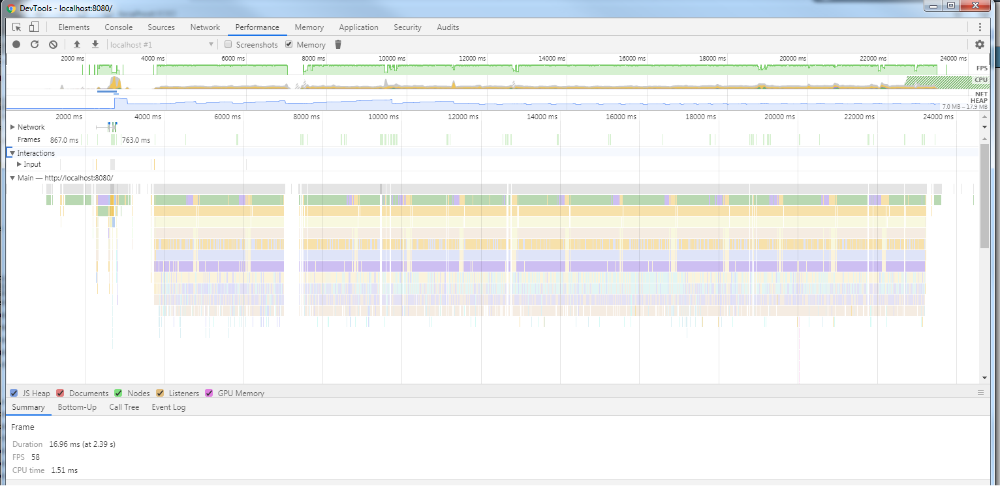

# WC3V reference web client

A stripped down example implementation of a birds eye view style drawing of a Warcraft 3™ (WC3) match.

This client aims to show the capabilities of the `wc3v` file format and it's ability to represent rich data from a WC3 match.

## Design

The WC3V viewer reduces cutter and makes unit groupings based on collision checks via spacial indexing done with [RBush](https://github.com/mourner/rbush)

## Setup

Vendor libraries:

* CDN delivered version of `d3` [ref link](https://cdnjs.cloudflare.com/ajax/libs/d3/5.9.7/d3.min.js)
* CDN delivered version of `rbush` [ref link](https://unpkg.com/rbush@2.0.1/rbush.min.js)

A suggested way to run the `wc3v` client is to install the NPM `http-server` package:  

`npm install -g http-server`

Then from the `wc3v` client directory simply run `http-server`

## Application Performance Profile

